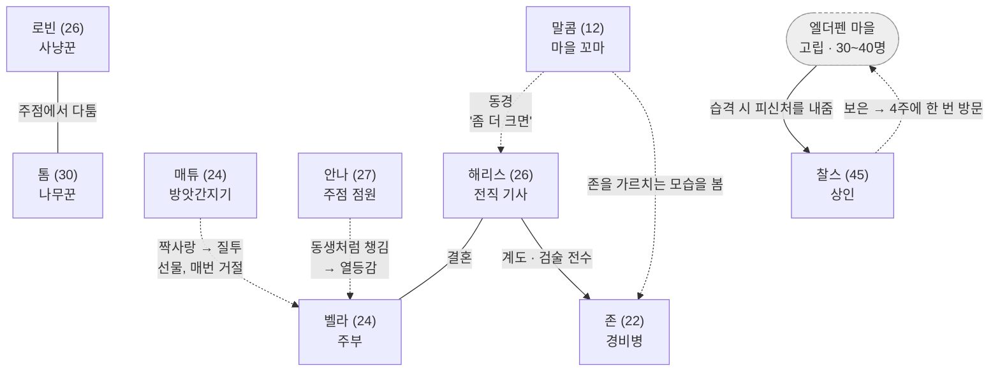

# 엘더펜 마을 NPC 컨셉

> **작업 기간**: 2025-06-11 ~ 2025-11-20 (Ver0.1 → Ver1.01, 9개 버전)
> **산출물**: NPC 14명 (기능 8 / 장식 6)
> **원본**: `박준서_20251120NPC컨셉_Ver1.01.pptx`
> **최신**: `박준서_20260810NPC컨셉_Ver1.02.pptx` — QA 수정 반영 (5장 참고)

---

## 1. 마을 설계

| 항목 | 내용 |
|---|---|
| 이름 | **엘더펜** — `Elder`(오래된 / 딱총나무) + `fen`(고어로 습지·땅) |
| 인원 | 30~40명 |
| 규모 | 소규모 |
| 역할 | 메인 퀘스트 진행 / 전사 직군 전직 |
| 컨셉 | 변경 부근에 자리잡은 자작의 영지. 변경백의 영지로 가는 길에 들르기에도 애매한 위치. 고립성이 강해 다른 마을과 소통이 어렵다 |

**설정**

> 30년 전 영지 분쟁으로 집을 잃은 사람들이 서로 의지하며 작은 계곡에 새로 터를 잡아 세운 마을이다.
> 변경백과 자작령 사이의 애매한 위치 덕에 전쟁을 비켜가 조용하고 평화로운 나날을 이어오고 있다.
> 뒤편 언덕에 오래된 석조 폐허가 있어 주민들은 "언젠가 복원하면 좋겠다"며 기대한다.

### 위치 설정이 기능을 규정한다

`애매한 위치` → `고립` 이라는 설정 하나가 마을의 모든 기능을 정당화한다.

- 상인 찰스가 **4주에 한 번만** 방문하는 이유
- 대장장이 비고가 **마을 유일**인 이유
- 약제사 플로라가 **민간 치료법**을 쓰는 이유 (정상적인 치료법이 없다)
- 경비병이 **존 한 명**뿐이라 플레이어의 도움이 필요한 이유

**마을이 작다는 사실이 곧 퀘스트 발생 조건이 된다.**

---

## 2. 관계망

이 문서의 핵심이다. NPC가 개별 카드가 아니라 서로 물린 사회 구조를 이룬다.

찰스만 개인이 아니라 **마을 전체와 관계를 맺는다.**
다른 관계는 사람 대 사람이지만, 상인의 방문 동기는 마을이 그에게 한 일에서 나온다.
이 하나가 `고립되어 있는데 왜 상인은 오는가`라는 구멍을 막는다.

### 관계가 만드는 것

| 관계 | 기능적 의미 |
|---|---|
| 해리스 → 존 (계도) | 문제아 출신 존이 경비병이 된 경위. 마을이 사람을 다시 받아들인 사례 |
| 말콤 → 해리스 (동경) | `해리스가 존을 가르치는 모습을 봤다`는 계기가 명시되어 있다. 관계에서 관계가 파생된다 |
| 매튜 → 벨라 (짝사랑) | 매튜의 나태함(`일은 잘 안 함`)과 상인 방문 시 선물 구매가 하나의 동기로 묶인다 |
| 안나 → 벨라 (열등감) | `기사와 결혼하는 환상` + `벨라를 동생처럼 챙김` + `해리스가 데려간 뒤 열등감`. 술이 들어가면 비꼬는 말투의 근거 |
| 찰스 → 마을 (은혜) | 습격받아 피신했다가 도움을 받았고, 그래서 크게 갚고자 한다. 상인이 오지 않을 이유가 없어진다 |

**말콤의 동경이 특히 잘 설계되어 있다.**
`말콤 → 해리스`가 단독으로 존재하지 않고 `해리스 → 존`을 경유한다.
관계가 사건을 만들고, 그 사건이 다시 관계를 만드는 구조다.

---

## 3. 기능 NPC (8명)

| 이름 | 나이 | 직업 | 제공 기능 |
|---|---|---|---|
| 보퍼트 | 85 | 마을 촌장 | 여관 / 식량 제작 |
| 찰스 | 45 | 상인 | 상점 |
| 해리스 | 26 | 전직 기사 (편력기사) | 전사 직군 전직 |
| 비고 | 50 | 대장장이 | 무기 내구도 수리 |
| 플로라 | 67 | 약제사 | 치료 |
| 랜즈던 페티피셴드 | 34 | 음유시인 | 메인 퀘스트 |
| 존 | 22 | 경비병 | 일반 / 데일리 퀘스트 |
| 매튜 | 24 | 방앗간지기 | 식량 재료 |

각 NPC는 `이름 · 성별 · 직업 · 기능 · 나이 · 키 · 체형 · 외형 · 성격 · 설정` 10개 항목과
**대표 대사 1줄**, **외형 요소 라벨**을 갖는다.

### 대표 대사가 성격을 압축한다

| NPC | 대사 | 드러나는 것 |
|---|---|---|
| 보퍼트 | "마을은… 오늘도 평온해야 할 텐데. 자네, 무슨 일 없는가…?" | 불안 회피적 성격 + 최연장자의 책임감 |
| 비고 | "응? 뭐라고? 다시 말해줘! 쇠 두드리느라 귀가 잘 안 들려서!" | 청력 손상이라는 설정을 대사로 즉시 전달 |
| 플로라 | "아프면 말하지 말고 그냥 앉아! 치료는 내가 알아서 한다니까." | 괴팍함 + 화상 자국을 숨기려는 태도 |
| 매튜 | "일? 에이… 귀찮아. 대신 뭐 살 건 있어?" | 게으름 + 상인 방문에 대한 관심 |

**비고의 대사가 가장 효율적이다.** `오랜 망치질로 청력이 나쁘다`는 설정을 설명하지 않고
대사 한 줄로 플레이어가 직접 겪게 만든다.

### 외형 요소 라벨

각 슬라이드에 `깔끔한 셔츠` `굽은 등` `나무 지팡이` `달갑지 않은 표정` 같은
**시각 요소를 별도로 태깅**했다. 아트 발주를 전제한 형식이다.

---

## 4. 장식 NPC (6명)

| 이름 | 나이 | 직업 | 역할 |
|---|---|---|---|
| 말콤 | 12 | 마을 꼬마 | 기사 동경 — 성장 서사의 씨앗 |
| 그레이스 | 21 | 수녀 | 도덕성·기초 교육 |
| 로빈 | 26 | 사냥꾼 | 마을 식량 일부 담당 |
| 톰 | 30 | 나무꾼 | 로빈과의 대비 |
| 벨라 | 24 | 주부 | 관계망의 중심 |
| 안나 | 27 | 주점 점원 | 마을 소문의 창구 |

기능 NPC와 장식 NPC를 **시스템 관점으로 분류**한 것이 적절하다.
장식 NPC는 기능을 제공하지 않지만 **마을이 살아 있다는 인상**과
**관계망의 밀도**를 담당한다.

특히 벨라는 기능이 없는 장식 NPC인데도 관계망의 중심에 있다.
해리스 · 매튜 · 안나 세 명의 동기가 벨라를 경유한다.

---

## 5. QA 수정 이력 (Ver1.02, 2026-08-10)

검수 과정에서 복사 흔적과 미완성 문장을 발견하여 수정했다.

| 위치 | 문제 | 수정 |
|---|---|---|
| 로빈 (S17) | 외형 요소 라벨에 **`수녀모`** — 그레이스(수녀) 슬라이드에서 복사 후 미수정 | `화살통` |
| 벨라 (S19) | 성격이 말콤과 **완전히 동일** (`장난꾸러기 / 말괄량이 / 낙천적 / 고집있는`) | `온화함 / 붙임성 있는 / 무던한 / 헌신적인` |
| 마을 이름 (S4) | 표지는 `엘더펜`, 마을 컨셉 슬라이드는 `엘데펜` | `엘더펜`으로 통일 |
| 존 (S12) | 설정 마지막 문장이 잘림 — `"적은 경비병의 수에 플레이어에게"` | `"적은 경비병의 수로 인해 플레이어에게 도움을 요청한다."` |

### 벨라의 성격을 다시 정한 기준

기존 값은 말콤(12세)의 성격을 그대로 복사한 것이었다.
다시 정할 때는 이미 확정된 **대사**와 **관계**에 맞췄다.

> "아, 남편이 또 훈련하러 갔나요? 참, 열정적이죠 그 사람."

- **온화함 · 붙임성 있는** — 마을 관계망의 중심에 있으려면 사람을 밀어내지 않아야 한다
- **무던한** — 매튜의 짝사랑과 안나의 열등감을 **본인은 눈치채지 못한다.** 이 둔감함이 두 관계를 유지시키는 조건이다
- **헌신적인** — 남편의 훈련을 체념이 아니라 애정으로 받아들이는 대사와 맞는다

특히 `무던한`이 구조적으로 필요하다.
벨라가 매튜의 마음이나 안나의 감정을 알아챘다면 그 관계들은 이미 정리되었을 것이다.
**주변 인물의 동기가 유지되려면 중심 인물이 모르고 있어야 한다.**

> 복사 흔적은 문서 전체의 신뢰를 떨어뜨린다.
> 24세 주부와 12세 아이가 같은 성격일 수는 없고, 사냥꾼이 수녀모를 쓸 수도 없다.
> 검수 없이 넘어갔다면 나머지 13명의 설정까지 의심받았을 항목이다.

---

## 6. 이 작업에서 배운 것

- **설정 하나가 여러 기능을 정당화할 수 있다.** `고립된 위치`가 상인 방문 주기, 대장장이 수, 치료법, 경비병 수를 전부 설명한다.
- **관계는 사건을 경유할 때 살아난다.** `말콤 → 해리스`보다 `말콤 → (해리스가 존을 가르치는 장면) → 해리스`가 훨씬 구체적이다.
- **대사 한 줄로 설정을 전달할 수 있다.** 비고의 청력 설정처럼, 설명하지 않고 겪게 만드는 편이 효율적이다.
- **기능이 없는 NPC도 구조적 역할을 가진다.** 벨라는 아무 기능도 제공하지 않지만 세 명의 동기를 지탱한다.
- **아트 발주를 전제한 형식이 필요하다.** 외형 요소를 별도 태깅하면 문서가 실제 제작 단계로 넘어갈 수 있다.

---

## 관련 문서

- [UX Feedback](../MechanicStudy/UXFeedback.md) — 설명 없이 정보를 전달하는 설계
- [INSIDE 분석](../GameAnalysis/INSIDE.md) — 레벨 디자인과 배치로 안내하는 방식
