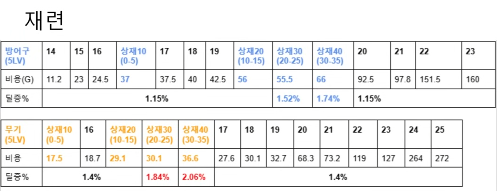
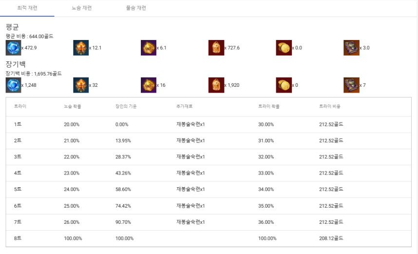
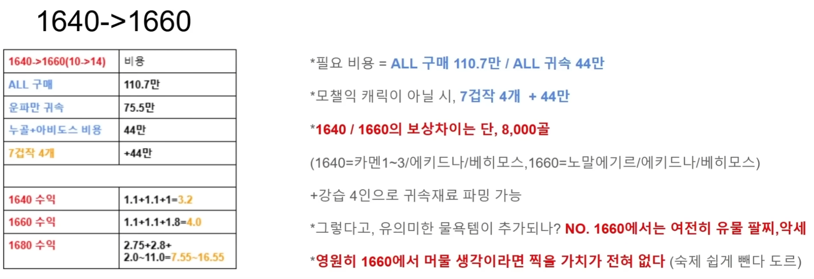

# 로스트아크 재련 시스템 분석 (SWOT)

> **분석 기간**: 2025-02-05 ~ 2025-05-14 (약 3개월, 25개 버전)
> **분석 대상**: 로스트아크 장비 재련 시스템
> **분석 도구**: SWOT → TOWS 매트릭스
> **검증 시점**: 2026-08 — 분석으로부터 15~18개월 경과 후 실제 패치와 대조
> **이미지**: 발표자료 `박준서_20250514_로스트아크_강화_SWOT분석_Ver0.3.pptx`의 15p · 16p · 23p에서 추출
> **발표자료 PDF**: [LostArk_Refining_SWOT.pdf](./pdf/LostArk_Refining_SWOT.pdf) — 5쪽

이 문서는 원본 분석을 보존하고, 그 아래에 **이후 실제 패치와의 대조**를 덧붙인 것이다.
원본 판단은 수정하지 않았다. 빗나간 예측도 그대로 남겼다.

---

## 1. 분석 시점의 근거

예측 검증이 성립하려면 분석 시점이 특정되어야 한다.

| 파일 | 수정 시각 | 상태 |
|---|---|---|
| `..._20250205_..._Ver0.1.emm` | 2025-02-05 20:51 | 초기 마인드맵 |
| `..._20250211_..._Ver0.1.emm` | 2025-02-11 20:54 | 확장 |
| **`..._20250212_..._Ver0.2.emm`** | **2025-02-13 20:45** | **TOWS 전략 12개 완성** |
| `..._20250225_..._Ver0.2.pptx` | 2025-02-26 19:08 | 발표자료 뼈대 |
| `..._20250403_..._Ver0.3.pptx` | 2025-04-03 20:52 | 내용 완성 |
| `..._20250514_..._Ver0.3.pptx` | 2025-05-14 | 최종본 |

**핵심 판단은 2025년 2월 13일 마인드맵에서 이미 완성되어 있었다.**
이후 3개월은 그 판단을 발표 자료로 옮기고 근거를 보강한 기간이다.

> 파일의 `수정한 날짜`가 파일명 날짜와 일치하며, 매일 저녁 8~9시대 작업 흔적이 남아 있다.
> 단, 2025-04-10 이후 파일은 백업 과정에서 타임스탬프가 소실되어 파일명에만 의존한다.

---

## 2. 재련 시스템 개요

장비 아이템의 성장을 통해 아이템 레벨과 능력을 향상시키는 성장 시스템.

- 대도시의 `[장비 재련]` NPC를 통해 진행
- 다양한 재료 아이템과 재화를 소모
- 추가 재료를 통해 성공 확률 상승 가능
- 재련 실패 시 **장인의 기운** 상승, 100%가 되면 확정 성공 (천장)
- 성공 시 누적된 장인의 기운 초기화

---

## 3. SWOT 분석

### Strength

| 항목 | 내용 |
|---|---|
| 재련 단계별 이펙트 | 23강 / 24강 / 25강마다 다른 화려한 이펙트 제공 |
| 전광판(브로드캐스팅) 연출 | 성공을 공개적으로 부각하여 선망과 강화 욕구를 자극 |
| 결과 즉시 확인 기능 | 반복적인 실패 연출을 생략해 심리적 부담 감소 |

### Weakness

| 항목 | 내용 |
|---|---|
| 천장까지의 횟수 미제공 | 답답함 유발 및 외부 사이트 의존 |
| 성장 체감 부족 | 재련 기댓값 대비 실제 피해량 상승률이 낮음 |
| 디메리트 부재 | 타 게임 대비 재련/강화에 걸린 것이 적어 간절함이 결여 |

### Opportunity

| 항목 | 내용 |
|---|---|
| 점핑 익스프레스 | 주기적으로 진행되는 이벤트 (2024년 겨울 등) |
| 실패 보상 구조 | 재련 실패 시 추가 성공률 제공 — 부담 감소 장치가 이미 존재 |
| 특수 재련 | 특수 재련 재료로 무료 시도 가능 — 성장 기대감 제공 |

### Threat

| 항목 | 내용 |
|---|---|
| 비용 대비 낮은 보상 | 재련 비용 증가폭에 비해 보상 증가가 작아 선호도 감소 |
| 재료 수급 구조 부담 | 수급량 대비 과도한 소모량으로 피로도 증가 |
| **스토리 몰입 저해** | **아이템 레벨 제한으로, 재련 없이 다음 스토리를 즐길 수 없는 구조** |

---

## 4. 근거 — 비용 대비 성장 체감

Weakness의 `성장 체감 부족`을 뒷받침하는 실측 데이터.



*발표자료 16p — 당시 정리한 원본 표. 아래 표는 이것을 옮긴 것이다.*

이 표에서 상급 재련(방어구 파란색 · 무기 주황색)은 일반 재련과 **같은 줄에 섞여 있다.**
두 시스템을 나란히 놓고도 당시에는 구간을 나눠 비교하지 않았다.
그 비교가 이 문서의 뒷부분에서 뒤늦게 나온다.

### 방어구 (5LV)

| 단계 | 14 | 15 | 16 | 17 | 18 | 19 | 20 | 21 | 22 | 23 |
|---|---|---|---|---|---|---|---|---|---|---|
| 비용(G) | 11.2 | 23 | 24.5 | 37.5 | 40 | 42.5 | 92.5 | 97.8 | 151.5 | 160 |
| 딜증% | 1.15 | 1.15 | 1.15 | 1.15 | 1.15 | 1.15 | 1.15 | 1.15 | 1.15 | 1.15 |

상급 재련 구간(상재10 / 20 / 30 / 40): 비용 37 / 56 / 55.5 / 66, 딜증 1.15 / 1.15 / **1.52** / **1.74**

### 무기 (5LV)

| 단계 | 16 | 17 | 18 | 19 | 20 | 21 | 22 | 23 | 24 | 25 |
|---|---|---|---|---|---|---|---|---|---|---|
| 비용 | 18.7 | 27.6 | 30.1 | 32.7 | 68.3 | 73.2 | 119 | 127 | 264 | 272 |
| 딜증% | 1.4 | 1.4 | 1.4 | 1.4 | 1.4 | 1.4 | 1.4 | 1.4 | 1.4 | 1.4 |

상급 재련 구간: 비용 17.5 / 29.1 / 30.1 / 36.6, 딜증 1.4 / 1.4 / **1.84** / **2.06**

### 도출 — 비용당 효율

| 대상 | 시작 단계 | 최종 단계 | 효율 변화 |
|---|---|---|---|
| 방어구 | 14강 → 0.103 %/G | 23강 → 0.0072 %/G | **약 14배 악화** |
| 무기 | 16강 → 0.075 %/G | 25강 → 0.0051 %/G | **약 15배 악화** |

> 비용은 14~15배로 증가하는데 딜증은 1.15~1.4%로 사실상 고정된다.
> **투입은 지수적으로 늘고 보상은 선형에도 미치지 못하므로, 진행할수록 의욕이 감소한다.**

### 그런데 상급 재련은 곡선이 반대다

같은 표에서 상급 재련 구간만 떼어내면 정반대의 그래프가 나온다.

| | 일반 재련 (방어구 14 → 23) | 상급 재련 (상재 10 → 40) |
|---|---|---|
| 비용 | 11.2 → 160 G — **14배 증가** | 37 → 66 G — **1.8배 증가** |
| 딜증 | 1.15% → 1.15% — **고정** | 1.15% → 1.74% — **1.5배 증가** |
| 곡선 | 투입 급증 / 보상 정체 | **투입 평탄 / 보상 증가** |

상재20(56G) → 상재30(55.5G)에서 비용이 오히려 **감소**하는데, 딜증은 1.15 → 1.52로 오른다.
표기 오류가 아니라 상급 재련 구간의 비용이 거의 평탄하다는 뜻이다.

### 비용당 효율 — 두 성장 경로의 격차

| 대상 | 일반 재련 최종 | 상급 재련 최종 | 격차 |
|---|---|---|---|
| 방어구 | 23강 — 0.0072 %/G | 상재40 — **0.0264 %/G** | **3.7배** |
| 무기 | 25강 — 0.0051 %/G | 상재40 — **0.0563 %/G** | **11배** |

무기 기준으로 보면 극단적이다.

```
25강    : 272.0 G  →  1.40 %
상재40  :  36.6 G  →  2.06 %
```

**비용은 7분의 1인데 딜증은 1.5배다.**

### 진짜 문제는 성장 체감 부족이 아니었다

원본 분석은 `성장 체감 부족`을 Weakness로 잡았다. 표를 다시 보면 진단이 한 단계 얕았다.

> **성장 경로가 둘인데 하나가 압도적으로 우월하다.**

상급 재련이 같은 골드로 3.7~11배의 딜증을 준다면, 일반 재련은 **성장 수단이 아니라
상급 재련을 열기 위해 지나가야 하는 통행세**가 된다.

플레이어가 의욕을 잃는 지점은 "올려도 안 세지네"가 아니라
**"이걸 왜 올려야 하지"** 쪽에 더 가깝다.

| | 체감 |
|---|---|
| 비용 대비 보상이 낮다 | 아쉽지만 납득은 된다 |
| **더 싼 대안이 옆에 있다** | **지금 하는 행동이 낭비로 느껴진다** |

**절대적인 비효율보다 상대적인 비효율이 이탈을 만든다.**
이 관점은 원본 분석에 없었고, 4장의 표를 뒤늦게 계산하면서 나왔다.

### 덧붙여 — 위 비용은 전부 기댓값이다

재련은 확률 시스템이므로 표의 비용은 평균값이고, 실제로 내는 값은 사람마다 다르다.
발표자료 15p에 그 편차가 남아 있다.



| 항목 | 값 |
|---|---|
| 평균 비용 | 644.00 골드 |
| **장기백 비용** (천장까지 갈 경우) | **1,695.76 골드** |
| 편차 | **약 2.6배** |
| 천장 도달 | 8트 (1트 20% → 7트 26%, 8트 100%) |

**표의 비용은 운이 평균일 때의 값이고, 운이 나쁘면 2.6배를 낸다.**
4장의 효율 수치는 낙관적인 쪽 기준이라는 뜻이다.

그리고 이 화면은 게임 안이 아니라 **외부 계산기 사이트**다.
Weakness의 `천장까지의 횟수 미제공 → 외부 사이트 의존`이 이 이미지 한 장으로 증명된다.

> 플레이어는 자신이 얼마를 낼지 알기 위해 게임을 나가야 한다.
> **정보를 감추면 플레이어가 정보를 포기하는 것이 아니라 다른 곳에서 구해온다.**

---

## 5. 근거 — 투자 회수 기간

발표자료 23p에는 딜증과는 다른 축의 분석이 하나 더 있었다.
**아이템 레벨을 올리는 데 든 골드를 레이드 보상으로 회수할 수 있는가**를 본 것이다.



> **출처**: 유튜브 채널 `포피셜`. 원본 발표자료(23p)에는 출처가 표기되어 있지 않아 이번에 보완했다.
> 아래 표는 이 자료의 수치를 옮긴 것이며, 회수 기간 계산은 이 문서에서 새로 한 것이다.

### 투입

| 조달 방식 | 비용 |
|---|---|
| ALL 구매 | **110.7만 골드** |
| 운파만 귀속 | 75.5만 골드 |
| 누골 + 아비도스 귀속 | **44만 골드** |
| (모챌익 캐릭이 아닐 경우) 7겁작 4개 | +44만 골드 |

### 회수

| 아이템 레벨 | 주간 레이드 수익 | 구성 |
|---|---|---|
| 1640 | 1.1 + 1.1 + 1.0 = **3.2만 골드** | 카멘1~3 / 에키드나 / 베히모스 |
| 1660 | 1.1 + 1.1 + 1.8 = **4.0만 골드** | 노말 에기르 / 에키드나 / 베히모스 |
| 1680 | 2.75 + 2.8 + (2.0~11.0) = **7.55~16.55만 골드** | |

> **1640과 1660의 주간 수익 차이는 8,000골드다.**

### 회수 기간

```
최소 투입 44만 ÷ 주당 0.8만  =  55주   ≈ 1년 1개월
최대 투입 110.7만 ÷ 주당 0.8만 = 138주  ≈ 2년 8개월
```

**1660은 회수되지 않는 구간이다.**
게임의 시즌 주기를 생각하면 55주 뒤에도 1660이 유효한 목표일 가능성은 낮다.

### 그런데 1680은 회수된다

| 구간 | 주간 수익 증가 |
|---|---|
| 1640 → 1660 | +0.8만 |
| 1660 → 1680 | **+3.55 ~ +12.55만** |

**보상은 1660이 아니라 1680에 걸려 있다.**
그리고 1660은 건너뛸 수 없다. 1680으로 가려면 반드시 지나가야 하는 구간이다.

> 원본 슬라이드의 결론 — **"영원히 1660에서 머물 생각이라면 찍을 가치가 전혀 없다"**

### 4장과 5장은 같은 구조를 다른 배율로 본 것이다

| | 4장 (재련 단계) | 5장 (아이템 레벨) |
|---|---|---|
| 통행세 구간 | 일반 재련 | 1660 |
| 보상 구간 | 상급 재련 | 1680 |
| 격차 | 효율 3.7~11배 | 주간 수익 4.4~15.7배 |
| 문제 | 지나가야 하는데 그 자체로는 손해다 | 동일 |

**같은 설계 습관이 두 계층에서 반복된다.**
성장 경로 위에 `비용만 드는 구간`과 `보상이 몰린 구간`을 번갈아 두면,
플레이어는 전자에 있는 동안 계속 손해를 감수하고 있다는 감각을 갖는다.

이것이 원본이 `비용 대비 낮은 보상`이라고만 적었던 위기의 실제 형태다.

---

## 6. TOWS 전략

SWOT 네 칸을 채우는 데서 멈추지 않고 교차 전략을 도출했다.

### SO — 강점으로 기회를 살린다

- 자동 재련 기능 제공 (원안: 재련 N회 반복 기능)
- 무기 이펙트의 아이템 레벨별 제공
- 추가 메리트를 얻을 수 있는 내실 요소 추가 (영지 연구)

### WO — 기회로 약점을 보완한다

- **천장까지의 재련 횟수 제공**
- 점핑 익스프레스 캐릭터의 일정 아이템 레벨까지 재련 성공 시 단계 +1이 아닌 +2 제공
- 특수 재련 재료를 이용해 재련에 도움이 되는 아이템 제공

### ST — 강점으로 위기를 막는다

- 인게임 내부 랭킹 확인 시스템 제공
- 재련 난이도에 맞는 레이드 보상 제공
- 생활 컨텐츠 단축을 위한 단독 패키지 판매

### WT — 약점과 위기를 함께 줄인다

- 재련에 대한 리스크 제공 (사용 재료 감소, 사용 골드 증가)
- 강화 기댓값이 상승할수록 그에 맞는 성장 제공
- **스토리 전용 모드의 추가**

### 최종 개선안 (구체화)

12개 전략 중 2개를 화면 단위까지 구체화했다.

1. **자동 재련 기능** — 참고 사례: 바람의 나라의 자동 강화
2. **천장까지의 재련 횟수 출력** — 게임 내 UI에 직접 표시

---

## 7. 예측 검증 (2026-08 대조)

### 적중

| 2025-02-13 분석 | 실제 | 간격 |
|---|---|---|
| **위기** — 재련 없이 다음 스토리를 즐길 수 없는 구조로 부담 증가<br>**WT 전략** — 스토리 전용 모드의 추가 | 2025 윈터 쇼케이스: **티어4 이하 구간은 재련으로 성장하지 않도록 변경**, 메인 스토리 완료 시 **필요 장비 자동 지급**, **전 구간 스토리 익스프레스화** | 약 **10개월** |

문제 정의와 해결 방향이 모두 일치했다.
"스토리를 즐기려면 재련이 강제된다"는 진단과 "스토리 전용 경로를 열어라"는 처방이,
실제로는 "티어4 이하에서 재련을 성장 경로에서 제거"라는 형태로 구현되었다.

### 방향 적중

| 2025-02-13 분석 | 실제 | 간격 |
|---|---|---|
| **위기** — 비용 대비 낮은 보상, 재료 수급 대비 과도한 소모 | 2025-03-26 **상급 재련 1~20단계 비용 완화**<br>2025 윈터 쇼케이스 **티어3 재련 비용 실링화, 상급 재련 1~2단계 완화** | 6주 / 10개월 |

문제 진단이 맞았고, 게임사도 같은 방향(부담 완화)으로 반복 대응했다.

### 적중 — 제안한 전략이 구현된 것

| 2025-02-13 분석 | 실제 |
|---|---|
| **SO** — 재련 N회 반복 기능 (자동 재련) | **재련 10회 반복 기능 구현**. 어빌리티 스톤도 **10개 단위 자동 세공** 추가 |
| **SO** — 인게임 랭킹 시스템 | **랭킹이 표시되는 콘텐츠 추가** |

반복 작업 자동화와 경쟁 지표 노출은 둘 다 제안한 형태로 들어왔다.

### 빗나감

| 분석 | 실제 | 왜 빗나갔는가 |
|---|---|---|
| **WT** — 재련에 리스크 제공 (재료 감소, 골드 증가) | 정반대로 **부담을 계속 완화**하는 방향으로 진행 | 분석 시점에 이미 유저 이탈이 진행 중이었고, 리스크 추가는 이탈을 가속했을 것이다. 게임의 내적 논리(간절함 부족)만 보고 **시장 상황과 유저 심리를 반영하지 못한 판단**이었다. |

### 미확인

천장 횟수 표시, 영지 연구, 무기 이펙트 아이템 레벨별 제공, 생활 컨텐츠 단축 패키지 — 확인하지 못했다.

### 이 대조표의 근거

항목마다 근거가 다르므로 구분해서 적는다.

| 항목 | 근거 |
|---|---|
| 재련 10회 반복 · 어빌리티 스톤 자동 세공 · 랭킹 콘텐츠 | **직접 확인** |
| 윈터 쇼케이스 관련 항목 (티어4 이하 재련 변경, 비용 실링화) | 나무위키 업데이트 내역과 쇼케이스 정리 자료 — **공식 공지 원문으로 교체 필요** |

2차 자료로 채운 칸은 그대로 두되 근거를 밝혀 둔다.
**남의 정리를 내 검증의 근거로 쓸 때 출처를 감추면, 내용이 맞아도 검증할 수 없는 주장이 된다.**
같은 실수를 5장에서 한 번 했고(8장 참고), 여기서 반복하지 않기 위해 표를 나눴다.

---

## 8. 분석을 되돌아보며

### 잘한 것

- **SWOT을 네 칸으로 끝내지 않았다.** TOWS 교차 전략까지 도출했기 때문에 분석이 제안으로 이어졌다.
- **수치로 뒷받침했다.** "성장 체감이 부족하다"를 감상이 아니라 비용/딜증 표로 증명했다.
- **두 개의 축으로 봤다.** 딜증(4장)과 골드 회수(5장)는 서로 다른 질문이다. 하나만 봤다면 `약하다`나 `비싸다` 중 한쪽으로만 끝났을 것이다.
- **주장마다 증거 화면을 붙였다.** 천장 미제공은 외부 계산기 화면으로, 재료 부담은 제작 UI의 `필요/보유` 수치로 보였다. 말로 설명하지 않고 보여줬다.
- **제안한 전략 중 자동 재련과 인게임 랭킹이 이후 실제로 구현됐다.** (7장) 12개 전략을 던져 두고 끝내지 않고, 1년 뒤에 무엇이 들어왔고 무엇이 빗나갔는지 채점했다.

### 부족했던 것

- **12개 전략 중 2개만 구체화했다.** 나머지 10개는 한 줄로 남아 있어 실행 가능성 검토가 없다.
- **비용당 효율을 계산하지 않았다.** 표는 만들었지만 `딜증 ÷ 비용` 한 줄을 뽑지 않아, 주장을 숫자로 마무리하지 못했다. (이 문서의 4장은 그 계산을 뒤늦게 추가한 것이다.)
- **표 안에 답이 하나 더 있었는데 못 봤다.** 일반 재련과 상급 재련을 같은 표에 나란히 적어놓고도 두 구간을 비교하지 않았다. 비교했다면 `성장 체감 부족`이 아니라 `두 성장 경로의 효율 격차`라는 더 정확한 진단이 나왔을 것이다. **자료를 모으는 것과 자료를 대조하는 것은 다른 작업이다.**
- **두 근거를 연결하지 않았다.** 4장(재련 단계)과 5장(아이템 레벨)은 `통행세 구간과 보상 구간이 번갈아 놓인다`는 같은 구조를 다른 배율로 보고 있었는데, 발표자료에서는 서로 다른 슬라이드에 흩어져 있었다. 두 슬라이드를 붙였다면 개별 지적이 아니라 **설계 습관에 대한 지적**이 되었을 것이다.
- **인용 자료의 출처를 표기하지 않았다.** 5장의 회수 분석은 외부 채널의 자료인데 발표자료에 출처가 없었다. 남의 데이터로 내 주장을 뒷받침할 때 출처가 없으면, 자료가 정확해도 검증할 수 없는 주장이 된다. **이 문서에서 뒤늦게 보완했다.**
- **게임 내부만 봤다.** 빗나간 예측의 원인이 여기에 있다. 유저 이탈이라는 외부 상황을 고려하지 않고 시스템의 내적 논리만으로 처방을 냈다.

### 이후 분석에 반영한 것

`게임 내부 논리`와 `시장·유저 상황`을 분리해서 보는 습관은 이 분석 이후 생겼다.
[Hollow Knight 분석](../GameAnalysis/HollowKnight.md)의 `개발 의도 / 플레이 경험 / 시대적 변화` 3단 구분,
[Papers, Please 분석](../GameAnalysis/PaperPlease.md)의 `초회차 / 반복 플레이` 분리가 같은 계열의 기준이다.

---

## 관련 문서

- [Research Log](../ResearchLog.md) — 이 분석이 이후 작업에 어떻게 이어졌는가
- [젠레스 존 제로 성장 곡선 분석](./ZZZ_GrowthCurve.md) — 같은 `비용 대비 효율` 관점을 시간에 적용한 사례
