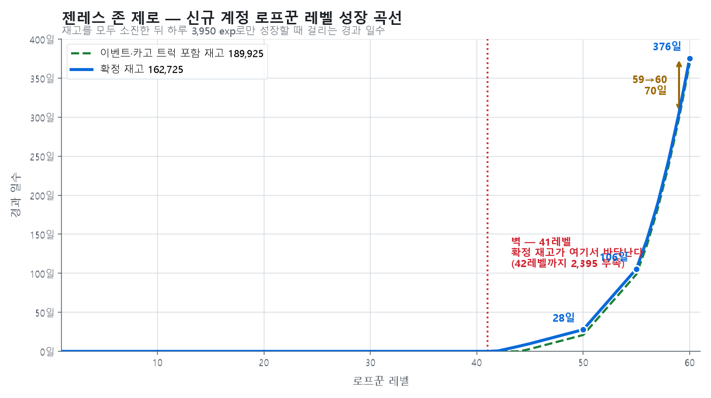

# 젠레스 존 제로 — 로프꾼 레벨 성장 곡선 분석

> **분석 시점**: 2026-01-21
> **분석 대상**: 로프꾼 레벨 성장에 필요한 시간과 재화
> **기준**: 완전 신규 계정 (레벨 1 시작), 시즌2 진행 중, 스토리 스킵 기준
> **계산 파일**: `젠레스존제로_성장시뮬레이션.xlsx`

---

## 1. 왜 신규 계정 기준인가

분석 기준을 정하는 것이 이 분석의 첫 번째 판단이었다.

알고자 한 것은 **데니 획득량 = f(로프꾼 레벨)** 이다.
로프꾼 레벨이 오르면 즐길 수 있는 콘텐츠가 늘고, 콘텐츠가 늘면 획득 재화가 늘어나기 때문이다.

| 기준 | 문제 |
|---|---|
| 기존 계정 | **레벨이 이미 상수**다. 상수를 넣고 함수를 구할 수 없다. |
| 기존 계정 | **생존 편향**이 발생한다. 이탈 지점을 찾는 분석에서 이탈하지 않은 표본만 보게 된다. |
| **신규 계정** | 레벨이 1부터 변수로 움직이므로 관계를 측정할 수 있다 |

따라서 신규 기준은 취향이 아니라 분석 목표에 의해 결정되었다.

**측정 방식**은 실제로 신규 계정을 육성한 것이 아니라,
콘텐츠별 해금 조건과 보상량을 수집해 **모델로 재구성**한 것이다.

---

## 2. 이 게임의 시간은 두 축이다

분석 중 가장 오래 막힌 지점은 "시간당 경험치"라는 단위가 성립하지 않는다는 것이었다.

| 축 | 정의 | 영향받는 요소 |
|---|---|---|
| **플레이 시간** | 실제로 조작한 시간 | 스토리 보기/스킵 |
| **경과 시간** | 그냥 흐르는 시간 | 배터리 회복, 일일·주간 리셋, 호감도 누적 |

배터리는 플레이하지 않아도 찬다. 반대로 배터리가 없으면 아무리 오래 붙잡고 있어도 경험치가 나오지 않는다.
**두 시간을 한 단위로 묶으려 했기 때문에 계산이 되지 않았다.**

### 해결 — 경험치원을 공급 방식으로 나눈다

| 유형 | 성격 | 해당 콘텐츠 |
|---|---|---|
| **재고 (Stock)** | 총량이 정해져 있고 쓰면 사라짐. 플레이 시간만 있으면 소진 가능 | 메인 스토리, 서브퀘스트, 에이전트 비화, 상시 이벤트, 그림자 작전, 제로 공동, 조사원 훈련 코스, 친구와의 동행, 우두머리 섬멸전, 카고 트럭, 로프꾼 전기, 전술 훈련 |
| **유량 (Flow)** | 경과 시간에 비례해 공급되며 하루 상한이 있음 | 배터리 소모 콘텐츠, 일일 활약도, 주간 리두 |

> 우두머리 섬멸전은 `캐릭당 1,200(600+600) × 8캐릭`으로 **캐릭터당 1회 지급되는 1회성**이다.
> 주간 반복 콘텐츠처럼 보이지만 경험치는 최초 1회만 나오므로 재고에 속한다.

---

## 3. 파라미터

| 항목 | 값 | 비고 |
|---|---|---|
| 배터리 자연 회복 | 6분당 1pt = 시간당 10pt = **일일 240pt** | |
| 배터리 최대 보유량 | **240pt** | 정확히 하루치. 24시간 미접속 시 손실 시작 |
| 배터리 일일 추가 획득 | 80pt | |
| **일일 총 배터리** | **320pt** | |
| 배터리 → 경험치 환산 | 10pt = 100 exp (1pt = 10 exp) | |
| 배터리 환산 경험치 | 3,200 exp/일 | |
| 일일 활약도 | 600 exp/일 (150 × 4) | |
| 주간 리두 (일할) | 150 exp/일 (150 × 7 ÷ 7) | |
| **일일 유량 합계** | **3,950 exp/일** | **이 값이 성장 속도의 상한이다** |

> 배터리 최대 보유량이 정확히 하루치라는 점이 중요하다.
> 24시간마다 접속하지 않으면 손실이 발생하므로, **접속 주기 자체가 설계되어 있다.**

### 재고 총량

재고를 두 등급으로 나눈다. **신규 계정이 언제 시작해도 접근할 수 있는가**가 기준이다.

#### 확정 재고 — 시작 시점과 무관하게 접근 가능

| 콘텐츠 | 경험치 | 산출 근거 |
|---|---|---|
| 메인 스토리 + 서브퀘 (에필로그 상까지) | 68,925 | 장별 누적 |
| 에이전트 비화 | 24,050 | 시즌1 1,250×13 + 시즌2 1,950×4 |
| 제로 공동 — 잃어버린 땅 | 26,400 | 조사 진도, 회당 1,200 |
| 제로 공동 — 메마른 도시 | 10,800 | 자격증 90레벨, n+1레벨마다 600 |
| 우두머리 섬멸전 | 9,600 | 캐릭당 1,200 × 8캐릭 (1회성) |
| 조사원 훈련 코스 | 7,000 | 200×20 + 8코스마다 600×5 |
| 로프꾼 전기 | 5,300 | 10단계 누적 53항목 |
| 그림자 작전 | 4,800 | 개당 600 × 8개 |
| 친구와의 동행 | 3,750 | 캐릭당 750 × 5미션 |
| 전술 훈련 (기본·기술·심화·마스터) | 2,100 | 150 × 14 |
| **소계** | **162,725** | |

#### 시점 의존 재고 — 언제 시작했는가에 따라 달라짐

| 콘텐츠 | 경험치 | 비고 |
|---|---|---|
| 상시 이벤트 | 16,950 | 8종 합산. 종료된 이벤트는 획득 불가 |
| 카고 트럭 | 10,250 | 1버전 50×24 + 2버전 50×181 |
| **소계** | **27,200** | |

| | 경험치 |
|---|---|
| **전체 합계** | **189,925** |

---

## 4. 결론

곡선이 **41레벨까지 바닥에 붙어 있다가 그 지점부터 수직에 가깝게 꺾인다.**
이 게임의 성장 구조가 한 장에 들어 있다.

### 레벨 도달까지 필요한 경과 일수

재고 등급에 따라 두 경우로 나뉜다. 유량은 양쪽 모두 3,950/일이다.

| 목표 | 누적 필요 exp | 확정 재고(162,725) 기준 | 전체 재고(189,925) 기준 |
|---|---|---|---|
| 41레벨 | 153,820 | **재고만으로 도달** | **재고만으로 도달** |
| 44레벨 | 189,160 | 약 7일 | **재고만으로 도달** |
| 50레벨 | 272,825 | 약 28일 | 약 21일 |
| 55레벨 | 580,455 | 약 106일 | 약 99일 |
| 60레벨 | 1,646,270 | **약 376일** | **약 369일** |

**시점 의존 재고 27,200을 전부 챙겨도 60레벨 도달이 7일 앞당겨지는 데 그친다.**
후반 구간에서는 재고의 크기가 거의 의미가 없다.

### 벽의 위치

| 기준 | 재고로 도달하는 레벨 | 다음 레벨까지 |
|---|---|---|
| 확정 재고 162,725 | **41레벨** | 42레벨(165,120)에 **2,395 부족** |
| 이벤트·카고 트럭 포함 189,925 | 44레벨 | 45레벨(201,900)에 11,975 부족 |

**확정 재고 162,725는 41레벨을 넘긴 직후 42레벨 문턱에서 멈춘다.**
남은 2,395는 42레벨 필요치의 1.5%이며, 하루치 유량(3,950)보다도 적다.

즉 **상시 콘텐츠를 전부 소진하면 41레벨에서 정확히 멈춘다.**
그 앞까지는 스토리와 콘텐츠로 빠르게 성장하다가, 이후로는 하루 3,950으로 고정된다.
접속 시간을 아무리 늘려도 이 값을 넘을 수 없다.

이벤트를 챙긴 유저만 44레벨까지 밀고 갈 수 있다.
**이벤트 참여 여부가 벽의 위치를 3레벨 옮긴다.**

### 레벨 곡선의 계단

| 구간 | 필요 exp | 유량 기준 소요일 |
|---|---|---|
| 50 → 51 | 35,000 | 8.9일 |
| 55 → 56 | 150,000 | 38.0일 |
| **59 → 60** | **276,325** | **70.0일** |

50레벨까지 누적이 272,825인데 60레벨까지가 1,646,270이다.
**마지막 10레벨이 전체 필요 경험치의 83%를 차지한다.**

---

## 5. 해석

> **이 게임은 플레이 시간이 아니라 경과 일수로 성장을 통제한다.**

| | 메이플스토리 | 젠레스 존 제로 |
|---|---|---|
| 주 제약 | 플레이 시간 | 경과 시간 |
| 10시간 연속 플레이 | 성장 약 10배 | 상한 고정 |
| 과금의 역할 | 시간 단축 | 상한 돌파 |
| 이탈 원인 | 지루함 | **할 게 없음** |

### 설계 의도 추론

1. **헤비 유저의 콘텐츠 소진 방지** — 하루 상한이 있으므로 아무리 열심히 해도 앞서 나갈 수 없다.
2. **접속 습관 형성** — 배터리 최대치가 하루치이므로 매일 접속해야 손실이 없다.
3. **후반 구간 인위적 연장** — 레벨 51, 56의 계단이 엔드게임 도달 시점을 늦춘다.

### 리스크

**재고 소진 시점(약 41레벨)이 이탈 위험 구간이다.**
그때까지의 성장 체감과 이후의 성장 체감 격차가 크기 때문이다.
따라서 **신규 이벤트 공급 주기가 이 게임 리텐션의 핵심 변수**가 된다.

### 스토리 보기 / 스킵 비교

두 시나리오는 **유량이 완전히 동일**하고 재고 소진 속도만 다르다.
그리고 그 차이의 크기를 원자료로 계산할 수 있다.

| | 스토리 보기 | 스토리 스킵 |
|---|---|---|
| 재고 총량 | 동일 | 동일 |
| 스토리 파트 | 최대 840분 (장당 2시간) | **420분** (장당 1시간) |
| 의뢰 파트 | 1,815분 | 1,815분 (동일) |
| 재고 소진 플레이 시간 | 최대 2,655분 | **2,235분** |
| 벽 도달 시점 | 늦다 | **최대 7시간 이르다** |

즉 **스킵하는 유저가 벽에 먼저 부딪히지만, 그 차이는 최대 7시간뿐이다.**

여기서 원래 예상과 다른 결과가 나왔다.
스토리를 브레이크로 봤는데, 실제로 시간을 잡아먹는 것은 **전투의뢰와 탐색의뢰(1,815분, 81%)**다.
스킵 가능한 스크립트는 전체 플레이 시간의 **16~32%**에 불과하다.

> **스토리는 브레이크가 아니다. 브레이크는 의뢰다.**
> 그리고 의뢰는 스킵할 수 없다. 게임이 소비 속도를 늦추는 실제 수단은
> 건너뛸 수 있는 연출이 아니라 **건너뛸 수 없는 반복 작업**이다.

---

## 6. 콘텐츠별 효율

| 콘텐츠 | 총 경험치 | 소요 시간 | 분당 exp | 경과 제약 |
|---|---|---|---|---|
| 친구와의 동행 | 3,750 | 7.5분 | **500** | 호감도 MAX까지 최소 5일 |
| 우두머리 섬멸전 | 9,600 | 40분 (캐릭당 5분 × 8) | **240** | 캐릭터 해금 필요 |
| 제로 공동 (잃어버린 땅) | 26,400 | 220분 (22회 × 10분) | 120 | 회차 제한 |
| 에이전트 비화 | 24,050 | 340분 (캐릭당 20분 × 17) | 71 | 캐릭터 해금 필요 |
| 그림자 작전 | 4,800 | 80분 (8개 × 10분) | 60 | — |
| 제로 공동 (메마른 도시) | 10,800 | 180분 (18회 × 10분) | 60 | 회차 제한 |
| **메인 스토리 + 서브퀘** | **68,925** | **2,235분** | **31** | **없음** |
| 조사원 훈련 코스 | 7,000 | — | — | 1주일 필요 |
| 카고 트럭 · 로프꾼 전기 | 15,550 | — | — | 시간 미기록 |
| 상시 이벤트 | 16,950 | 원본 `2시간 가량` | 판정 불가 | 이벤트당인지 전체인지 불명 |
| 전술 훈련 | 2,100 | 원본 `15분 내외` | 판정 불가 | 항목당인지 전체인지 불명 |

### 메인 스토리의 시간 내역

| 장 | 경험치 | 소요 시간 |
|---|---|---|
| 1장 | 12,250 | 350분 (스토리 60 + 전투 130 + 탐색 160) |
| 2장 | 16,400 | 580분 (60 + 200 + 320) |
| 2장 중간 | 7,300 | 260분 (60 + 80 + 120) |
| 3장 | 13,200 | 410분 (60 + 230 + 120) |
| 4장 | 13,500 | 420분 (60 + 320 + 40) |
| 5장 | 4,575 | 155분 (60 + 95) |
| 에필로그 상 | 1,700 | 60분 |
| **합계** | **68,925** | **2,235분 = 37.3시간** |

### 규칙 하나가 보인다

> **분당 효율이 높은 콘텐츠일수록 경과 시간 제약이 강하게 걸려 있다.**

친구와의 동행은 분당 500으로 압도적이지만 호감도 MAX까지 5일이 필요하고,
조사원 훈련 코스는 1주일이 필요하다.
반대로 제약이 없는 그림자 작전과 메마른 도시는 분당 60으로 최하위다.

**효율과 접근성을 반비례로 묶어 총량을 통제하는 구조다.**

### 그리고 이 규칙의 극단이 메인 스토리다

메인 스토리는 **최대 재고(68,925 — 확정 재고의 42%)인데 분당 효율은 최하위(31)다.**
경과 제약이 전혀 없는 대신, 시간으로만 값을 치르게 되어 있다.

| | 친구와의 동행 | 메인 스토리 |
|---|---|---|
| 분당 효율 | 500 | 31 — **16배 차이** |
| 경과 제약 | 5일 | 없음 |
| 총량 | 3,750 | 68,925 |

**게임이 큰 덩어리를 줄 때는 경과 시간이 아니라 플레이 시간으로 값을 받는다.**
두 축이 같은 목적(총량 통제)을 각각 다른 방식으로 수행하고 있다.

---

## 7. 이 분석의 한계

- **모델 기반 재구성**이며 신규 계정을 실제로 육성해 측정한 것이 아니다.
- 상시 이벤트와 카고 트럭은 시작 시점에 따라 접근 가능 여부가 달라지므로 **시점 의존 재고**로 분리했다.
  4장의 두 기준선은 그래서 나눠 계산한 것이다.
- 상시 이벤트 `2시간 가량`, 전술 훈련 `15분 내외`는 항목당인지 전체인지 표기가 불명확해 분당 효율을 내지 않았다.
- 카고 트럭과 로프꾼 전기는 경험치만 기록되어 있고 소요 시간이 없다.
- 파일명은 `데니분석`이지만 완성된 것은 경험치·레벨·시간 축이며, **데니(재화) 축은 별도 작업으로 분리했다.**

---

## 8. 다음 작업 — 데니 축

경험치 축이 완결되었으므로 같은 방법을 재화에 적용한다.

- 데니 획득량을 레벨의 **계단 함수**로 정리 (레벨 N에서 해금되는 콘텐츠 → 그 시점의 일일 데니 상한)
- 이 문서에서 만든 `재고 / 유량` 분류를 그대로 재사용한다

---

## 관련 문서

- [마비노기 모바일 재화 구조 분석](./Mabinogi_CurrencyMap.md) — 같은 재화 분석에서 반대 축(재고)을 다룬 사례
- [로스트아크 재련 SWOT](./LostArk_Refining_SWOT.md) — `투입 대비 효율`이라는 같은 관점을 비용에 적용한 사례
- [Reward Loop](../MechanicStudy/RewardLoop.md) — 보상 루프 일반론
